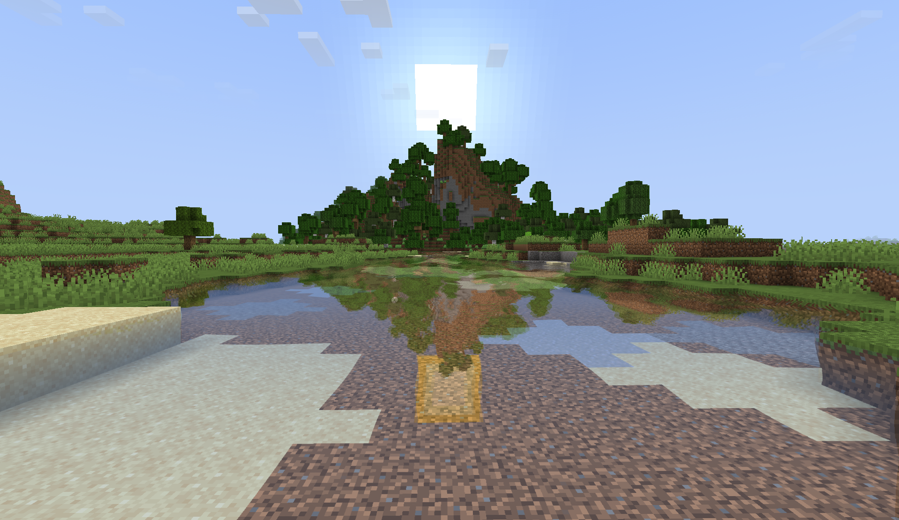

# Water Shader Alpha

## Introducing Water Shader Alpha for Minecraft 1.21! 
This shader is a complete rewrite of the old Water Shader Mod developed by Necrowizzard and later updated by Superbomb17 up to version 1.6.2 of Minecraft. The shader was a standalone mod for Minecraft Beta and Alpha versions. The shader used [planar reflection](https://www.youtube.com/watch?v=HusvGeEDU_U) to compute the reflection color on flat water patches. Most Minecraft shaders use [screen space reflections](https://lettier.github.io/3d-game-shaders-for-beginners/screen-space-reflection.html) (SSR) to compute reflections because of its ease of implementation in a deferred shading pipeline (Iris & Optifine). Instead, this shader uses planar reflection to reproduce the behavior of the original mod and to address the shortcomings of SSR. In addition, the original water shader was a mod incompatible with Optifine and Iris. This work brings the mod to the land of shaderpacks supported by Iris. This makes the shader much simpler to install and to use. The shader is still in alpha version, so expect bugs, inconsistencies, and slow performance especially near large water areas and depending on your hardware.

## Comparison
This shaderpack is more stable than the original mod which contained many bugs like: inconsistent lighting, flickering reflections, holes in water, crash of the game, white horizon artifact, transluscency artifacts, underwater bugs, and slow water updates. The new shaderpack is now robust to these issues and supports up to four simultaneous water heights for planar reflection. On the flip side, this shaderpack does not support particles, clouds, and star reflections on the water. Transparent geometry is omitted in the reflection texture for a lack of realism.

## Implementation
This shaderpack uses the shadow pass to compute the reflection texture for all water heights. The shadow geometry shader duplicates the scene for each detected water height and computes the reflection according to each water patch. The refraction and reflection textures are then mixed together to produce the final image. An additional process runs to detect which water patch is more important to prioritize reflection calculations on bigger water patches over smaller ones. This work is carried out by two compute shaders in the composite pass.

## FAQ
__Why update the Water Shader Mod?__ The Water Shader Mod was particularly important to me when I played Minecraft as a kid. I loved it and wanted to update this shader to bring it to Minecraft's newer versions.

__Why is the Water Shader Iris-only?__ Iris provides very useful features and gives additional controls and options to shader developers that Optifine do not support.

__What is the number of simulataneous planes in the settings?__ Planar reflection only allows to compute reflections for only one water height (plane height). Because Minecraft worlds can have multiple water patches at various heights, planar reflection fails to accurately compute reflections for all water patches. Thus, many iterations of the algorithm must run to compute reflections for each water patch. This process is expensive and decreases performance. For best performance, use one water plane. In my tests, two planes cover most scenarios.

__Is MacOS supported?__ No, because Apple decided to deprecate OpenGL. There is no way to run this shader on a mac computer unfortunately.

__Can I use your code in my shader projects?__ Yes, of course!

## Features
- Planar reflection
- Multiple water planes (up to 4)
- Automatic large water patch prioritization
- Distortion effects
- See-through water
- Better underwater fog
- Better transluscency
- Better sky & reflection on water
- Necrowizzard & Superbomb17 styles
- Sun & moon reflection in water (experimental)
- Vanilla lighting

## Liminations
- Clouds, stars, and particles not reflected
- Performance bottleneck in shadow geometry shader
- MacOS not supported

## Links
- [Superbomb17's Water Shader Mod Update](https://www.minecraftforum.net/forums/mapping-and-modding-java-edition/minecraft-mods/1285819-1-6-2-water-shader-alpha-over-325-000-downloads)

## Credits
I would like to thank [Coolq1000](https://github.com/coolq1000) for his help and advice. This shader would not have existed without his help. I would also like to thank the [shaderLABS](https://shaderlabs.org/wiki/Main_Page) discord community for their help.